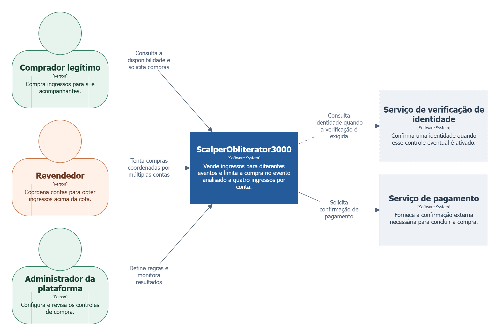
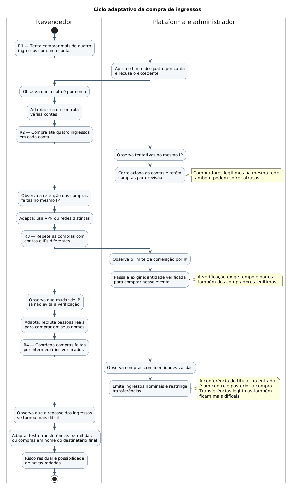
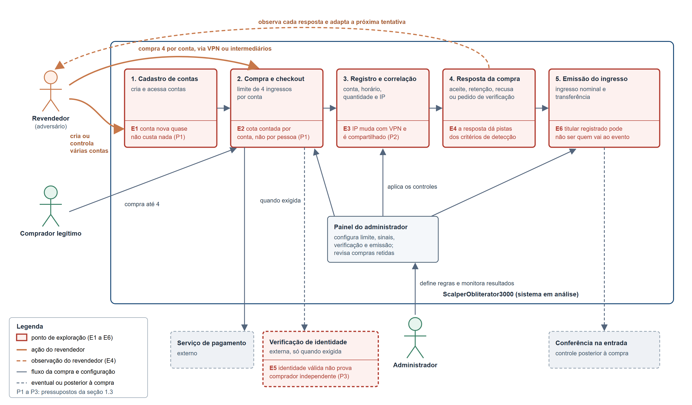

# Engenharia de Software Adversarial - Sistema de compra de ingressos

Análise de uma plataforma hipotética de venda de ingressos para diferentes eventos. O trabalho recorta a compra em um evento de alta demanda e examina como um revendedor pode superar o limite de quatro ingressos por conta, além das respostas da plataforma e seus efeitos sobre compradores legítimos.

## 🆔 Identificação 

> **Nome do sistema:** ``ScalperObliterator3000`` - Aplicativo de compra de ingressos <br>
> **Repositório:** [https://github.com/R-ZW/es-adversarial](https://github.com/R-ZW/es-adversarial)<br>
> **Vídeo de apresentação T1:** [link](#) <br>
> **Vídeo de apresentação T2:** [link](#) <br>
> **Justificativa:** A venda de ingressos em eventos de alta demanda expõe um conflito concreto entre distribuição justa e aquisição em escala para revenda. O limite por conta pode ser contornado com múltiplas contas; verificações adicionais provocam novas adaptações do revendedor e podem dificultar compras legítimas. O recorte permite analisar esse ciclo e é viável para uma implementação simulada no Trabalho 2. 

### 👥 Integrantes:

| Username do GitHub         | Nome Completo                         | Matrícula   |
|----------------------------|---------------------------------------|-------------|
| ```INARI18```              | Beatriz Roland Machado                | 2310101585  |
| ```CristhianKapelinski```  | Cristhian Eduardo Kapelinski de Avila | 0000000000  |
| ```guimsk```               | Guilherme Muller Schweitzer Klauberg  | 2310101588  |
| ```chicosbg```             | Luis Francisco Brum Gomes             | 2310100558  |
| ```R-ZW```                 | Reinaldo Zimmer Wendt                 | 2310100642  |

---

## Sumário

### 1. [📋 Descrição do sistema adversarial](#descricao-do-sistema)
### 2. [♟️ Modelo estratégico estático](#modelo-estatico)
### 3. [🔀 Modelo estratégico dinâmico](#modelo-dinamico)
### 4. [⚠️ Ameaças e riscos](#ameacas-e-riscos)
### 5. [🏁 Conclusão](#conclusao)

---

<a id="descricao-do-sistema"></a>

## 📋 1. Descrição do sistema adversarial

### 1.1 Sistema e recorte da interação

O ``ScalperObliterator3000`` é uma plataforma hipotética de venda online de ingressos para diferentes eventos. Pessoas interessadas podem criar uma conta, consultar a disponibilidade, selecionar ingressos e concluir uma compra. Após a confirmação, a plataforma emite ingressos digitais. Para esta análise, consideramos **a venda de ingressos de um evento específico de alta demanda**, com quantidade limitada de ingressos e sem assentos numerados. Nesse evento, a regra inicial permite comprar **até quatro ingressos por conta**, com a intenção de distribuir as oportunidades de compra entre mais pessoas.

O recorte deste trabalho é a **aquisição de ingressos acima desse limite por um mesmo interessado**, que pode controlar ou coordenar várias contas para reunir ingressos destinados à revenda. Analisaremos como a plataforma decide aceitar, limitar ou submeter compras a verificações adicionais, quais respostas o interessado consegue observar, e como ambos podem ajustar suas decisões nas tentativas seguintes. Compradores legítimos também participam desse cenário, pois medidas contra compras coordenadas podem dificultar o acesso de pessoas que seguem as regras.

A análise se concentra no processo de compra, da criação ou utilização de uma conta até a emissão do ingresso. A revenda fora da plataforma, o processamento real de pagamentos e a operação de entrada no evento não serão modelados como fluxos principais. A validação do ingresso na entrada poderá ser considerada como controle posterior, caso ajude a avaliar os efeitos e limites das defesas adotadas durante a compra.

> - **Sistema:** plataforma de venda de ingressos para diferentes eventos.
> - **Recorte:** compra em um evento de alta demanda, limitada a quatro ingressos por conta.
> - **Conflito:** um revendedor coordena contas para superar o limite, a plataforma busca preservar o acesso dos compradores legítimos.

### 1.2 Atores, objetivos e capacidades

Consideramos três papéis na interação. Para a análise estratégica, **a plataforma e seu administrador formam o lado defensor**: o software aplica as regras de compra, enquanto o administrador da plataforma define e ajusta essas regras. Essa distinção será mantida no diagrama de contexto.

| Ator | Objetivo | Ações ou capacidades | Informações observáveis | Restrições ou custos |
| --- | --- | --- | --- | --- |
| **Comprador legítimo** | Comprar até quatro ingressos para si e seus acompanhantes, sem impedimentos indevidos. | Criar e acessar uma conta; consultar disponibilidade; selecionar e comprar ingressos; cumprir verificações solicitadas. | Preço e disponibilidade exibidos; limite informado; pedidos de verificação; confirmação ou recusa da compra. | Preço dos ingressos; tempo de espera; estoque limitado; esforço e possível exposição de dados nas verificações. |
| **Revendedor** | Obter mais de quatro ingressos para o mesmo evento, reunindo-os para revenda. | Criar ou controlar várias contas; coordenar compras por outras pessoas; variar a origem das conexões; repetir tentativas após recusas. | Regras divulgadas; disponibilidade; solicitações de verificação; aceitação, limitação ou recusa das compras. Não conhece diretamente os critérios internos de detecção. | Capital para comprar ingressos; tempo e custo para manter contas, conexões e intermediários; estoque limitado; risco de bloqueio ou recusa. |
| **Plataforma e administrador** | Distribuir os ingressos conforme as regras do evento e manter a compra acessível aos usuários legítimos. | Definir limites; registrar tentativas; relacionar sinais de contas e conexões; solicitar verificações; aceitar ou recusar compras; ajustar controles. | Cadastros, tentativas e resultados de compra; endereços de rede utilizados; resultados das verificações; estoque. Não observa com certeza quem controla cada conta. | Custo operacional das verificações; necessidade de tratar dados pessoais; risco de barrar compradores legítimos ou permitir compras coordenadas. |

### 1.3 Regras e pressupostos

A propriedade a preservar é a **distribuição justa do estoque de ingressos**, sem impor obstáculos desproporcionais aos compradores legítimos. A **regra inicial** limita a quatro o total de ingressos comprados por uma mesma conta para o evento analisado, somando compras anteriores dessa conta. Ela não identifica, por si só, quem controla contas diferentes ou quem receberá os ingressos.

Para reconhecer compras possivelmente relacionadas, a plataforma pode observar **conta utilizada, horário das tentativas, quantidade solicitada e endereço IP**. Nas rodadas seguintes, o administrador pode usar esses sinais para solicitar verificações adicionais, inclusive de identidade. Esses dados são **indícios**, não provas de que duas compras pertencem à mesma pessoa; o limite por conta é o único controle obrigatório no cenário inicial.

| ID | Pressuposto | Como pode falhar | Consequência para o sistema |
| --- | --- | --- | --- |
| **P1** | Cada interessado usa uma única conta para comprar ingressos do evento. | Um revendedor cria ou controla várias contas e compra até quatro ingressos em cada uma. | O limite é respeitado em cada conta, mas um mesmo interessado acumula mais de quatro ingressos. |
| **P2** | O endereço IP ajuda a reconhecer compras coordenadas sem confundir compradores diferentes. | O revendedor muda de rede ou usa VPN; compradores legítimos compartilham uma rede doméstica ou pública. | Compras relacionadas podem passar despercebidas, enquanto compras legítimas podem ser sinalizadas. |
| **P3** | Verificar a identidade de cada comprador impede que uma pessoa concentre os ingressos. | O revendedor recruta pessoas reais para comprar até quatro ingressos cada uma e repassá-los depois. | As identidades são distintas e válidas, mas os ingressos continuam concentrados pelo mesmo interessado. |

> - **Regra inicial:** até quatro ingressos por conta no evento analisado.
> - **Sinais possíveis:** conta, horário, quantidade, IP e, se exigida, identidade verificada.
> - **Limite dos controles:** contas, redes e identidades distintas não garantem compradores independentes.

### 1.4 Diagrama de contexto

O diagrama de contexto segue o [modelo C4](https://c4model.com/diagrams/system-context) e foi definido em [Structurizr DSL](https://docs.structurizr.com/dsl/cookbook/system-context-view/): o **ScalperObliterator3000** é o sistema em análise; comprador legítimo, revendedor e administrador são pessoas que interagem com ele. O serviço de pagamento aparece apenas como dependência externa da compra, sem detalhar seu processamento. A verificação de identidade é uma integração **eventual**, acionada somente se esse controle for adotado em uma rodada posterior.



[Arquivo-fonte editável do diagrama em Structurizr DSL](diagramas/src/contexto.dsl).

### 1.5 Por que a interação é adversarial

A interação é adversarial porque o revendedor tenta **deliberadamente contornar o limite de quatro ingressos por conta** para concentrar ingressos e revendê-los, enquanto a plataforma busca distribuí-los de forma justa sem prejudicar compradores legítimos. Ao observar compras aceitas, recusas ou pedidos de verificação, o revendedor pode mudar de conta, rede ou comprador intermediário; a plataforma, por sua vez, observa as tentativas e ajusta seus controles. Portanto, o conflito não decorre de um erro isolado: os participantes têm objetivos diferentes e adaptam suas decisões às respostas um do outro.

<a id="modelo-estatico"></a>

## ♟️ 2. Modelo estratégico estático

### 2.1 Jogadores, informação e recorte

O modelo estático fixa uma única janela de venda do evento de alta demanda e analisa uma decisão simultânea entre dois jogadores: o revendedor e o defensor (plataforma e administrador, conforme a seção 1.2). Cada um escolhe sua estratégia sem observar a escolha do outro. É um jogo de informação imperfeita: a plataforma não sabe com certeza quem controla cada conta (P1 a P3), e o revendedor não conhece os critérios internos de detecção.

O comprador legítimo não é jogador estratégico, porque segue as regras e não adapta seu comportamento ao conflito. Seus custos entram na utilidade do defensor como atrito: demora, recusas indevidas e exposição de dados.

### 2.2 Estratégias

As estratégias são alternativas simultâneas para uma única janela de venda; portanto, não representam literalmente cada etapa temporal da seção 3. A1 e D1 descrevem as opções de referência (compra dentro da cota e controle básico). A tentativa inicial de exceder a cota, na rodada 1, serve para revelar a regra e não é uma estratégia adicional da matriz. As adaptações das rodadas seguintes são representadas pelas alternativas A2–A4 e D2–D4.

| Jogador | ID | Estratégia | Descrição |
| --- | --- | --- | --- |
| Revendedor | A1 | Conta única | Compra até quatro ingressos em uma conta, sem contornar a regra. |
| Revendedor | A2 | Várias contas, mesma rede | Controla várias contas e compra até quatro ingressos em cada uma, a partir da mesma rede. |
| Revendedor | A3 | Várias contas, redes distintas | Como A2, mas distribui as tentativas por redes distintas. |
| Revendedor | A4 | Intermediários reais | Recruta pessoas com identidades válidas para comprar em seus nomes e repassar os ingressos. |
| Defensor | D1 | Limite por conta | Aplica apenas o limite de quatro ingressos por conta. |
| Defensor | D2 | Limite e correlação por IP | Correlaciona contas pelo IP e retém compras suspeitas para revisão. |
| Defensor | D3 | Identidade verificada | Exige identidade verificada para comprar ingressos do evento. |
| Defensor | D4 | Ingressos nominais | Além da identidade, vincula o ingresso ao titular, restringe transferências e prevê conferência na entrada. |

### 2.3 Utilidades

Os payoffs são ordinais, de 0 a 10: servem para comparar preferências, não representam dinheiro nem probabilidades. Em cada par, o primeiro valor é do revendedor e o segundo é do defensor. O payoff do revendedor resume o benefício esperado da revenda menos os custos e perdas; o do defensor resume a distribuição do estoque a compradores legítimos menos o atrito e o custo dos controles.

### Premissas que sustentam os valores

- **A1:** rende pouco ao revendedor (no máximo quatro ingressos), mas não custa nada nem gera atrito adicional.
- **A2:** é lucrativa contra D1 e barata, mas é contida por D2, D3 e D4.
- **A3:** custa mais que A2 (gestão de redes distintas), escapa da correlação por IP, mas não das defesas baseadas em identidade ou titularidade.
- **A4:** tem custo de recrutamento e repasse. Pode contornar D1, D2 e D3 por meio de pessoas com identidades válidas, mas perde valor sob D4, que dificulta a transferência.
- **D2:** cria atrito moderado, pois compras legítimas em redes compartilhadas também podem ser retidas. D3 e D4 elevam o atrito com verificações, restrições de transferência e conferência na entrada; D4 é a defesa mais custosa para compradores legítimos.

### 2.4 Matriz de payoffs

Cada célula traz **(revendedor, defensor)**. O valor do revendedor em negrito indica sua melhor resposta na coluna; o valor do defensor em negrito indica sua melhor resposta na linha.

| Revendedor \ Defensor | **D1** Limite por conta | **D2** + correlação por IP | **D3** + identidade | **D4** + ingressos nominais |
| :-- | :--: | :--: | :--: | :--: |
| **A1** Conta única | (1, **8**) | (1, 7) | (1, 5) | (1, 4) |
| **A2** Várias contas, mesma rede | (**8**, 2) | (1, **7**) | (0, 5) | (0, 4) |
| **A3** Várias contas, redes distintas | (7, 2) | (**6**, 3) | (1, **5**) | (0, 4) |
| **A4** Intermediários reais | (5, 3) | (5, 2) | (**5**, 2) | (**2**, **4**) |

**Justificativa dos resultados.** A1 rende 1 ao revendedor em qualquer coluna por limitar a compra à cota. A2 rende 8 sob D1, mas cai para 1 ou 0 quando as contas são retidas ou a identidade é exigida. A3 rende menos que A2 contra D1 (7) por custar mais, mantém retorno 6 contra D2 porque redes distintas reduzem a eficácia da correlação, e cai para 1 ou 0 sob D3 e D4. A4 rende 5 contra D1–D3 porque os intermediários têm identidades válidas, mas o custo de recrutamento reduz o retorno; sob D4, o retorno cai para 2 devido à dificuldade de repasse.

Os payoffs do defensor refletem tanto a parcela de ingressos que permanece acessível a compradores legítimos quanto o atrito dos controles. Por isso, D1 recebe 8 contra A1, mas apenas 2–3 contra estratégias que concentram ingressos; D2 recebe 7 contra A1–A2 e menos contra estratégias que escapam à correlação ou usam intermediários; D3 recebe 5 contra A1–A3 e 2 contra A4; D4 recebe 4 em todas as linhas, representando a contenção adicional da revenda compensada pelo maior custo e atrito para compradores legítimos. Os números são ordinais e ilustrativos, não medições empíricas.

### 2.5 Análise

**Melhores respostas.** Para cada defesa, as melhores respostas do revendedor são: A2 contra D1, A3 contra D2 e A4 contra D3 ou D4. Para cada estratégia do revendedor, as melhores respostas do defensor são: D1 contra A1, D2 contra A2, D3 contra A3 e D4 contra A4.

A cadeia A2 → D2 → A3 → D3 → A4 → D4 ilustra as adaptações estratégicas das rodadas 2 a 4. A rodada 1 é anterior a essa cadeia: nela, a tentativa de exceder a cota revela a regra por conta e motiva o uso de várias contas.

**Equilíbrio de Nash em estratégias puras.** O único é (A4, D4), com payoffs (2, 4). É a única célula em que ambos estão em melhor resposta, e nenhum tem incentivo a desviar sozinho. Isso coincide com o risco residual da rodada 4: mesmo sob a defesa mais forte, o revendedor ainda prefere recrutar intermediários a desistir.

**Dominância.** A4 domina estritamente A1: seus payoffs contra D1–D4 (5, 5, 5, 2) são maiores que os de A1 (1, 1, 1, 1). Isso não significa que A4 seja estratégia dominante, pois A2 é melhor contra D1 e A3 é melhor contra D2. O revendedor, portanto, não tem uma estratégia dominante entre as quatro opções. O defensor também não tem estratégia dominante: sua melhor resposta depende da escolha do revendedor.

**Custo do equilíbrio para o defensor.** No equilíbrio, o defensor recebe 4, contra 8 em (A1, D1). A defesa mais robusta é a que mais pesa sobre os compradores legítimos, que absorvem o atrito da verificação, das restrições de transferência e da espera na entrada. O defensor não consegue eliminar a concentração; ele só a torna menos lucrativa, ao custo de dificultar a compra honesta.

**Sensibilidade.** O equilíbrio depende do payoff do revendedor em (A4, D4). Se ele cair de 2 para 0, por exemplo devido ao custo dos intermediários ou à dificuldade de repasse, A1 passa a ser preferível a A4 contra D4 e deixa de existir equilíbrio em estratégias puras. Seria então necessário analisar estratégias mistas ou rever o conjunto de estratégias; a ausência de equilíbrio puro, por si só, não implica que os jogadores tenham de alternar de forma determinística.

### 2.6 Decisão central em formato 2 × 2

A decisão central é o recorte **A1/A2 × D1/D3** da matriz da seção 2.4: o revendedor decide se **contorna a cota com várias contas**, e a plataforma decide se **exige identidade verificada**. Os payoffs foram reescritos como ordem de preferência de cada jogador (0 = pior, 2 = melhor), sem mudar a ordem que eles têm na matriz completa. Cada célula traz **(revendedor, defensor)**, e o negrito marca a melhor resposta, como na seção 2.4.

| Revendedor \ Defensor | **D1** Só limite por conta | **D3** Exige identidade verificada |
| :-- | :--: | :--: |
| **A1** Conta única | (1, **2**) | (**1**, 1) |
| **A2** Várias contas | (**2**, 0) | (0, **1**) |

1. **O que representa cada ação.** A1: comprar só os quatro ingressos de uma conta. A2: controlar várias contas e comprar quatro em cada uma. D1: aplicar só o limite por conta. D3: pedir identidade verificada antes da compra, para todos os compradores do evento.
2. **Por que cada payoff.** Para o revendedor, A2 contra D1 é o melhor resultado (2), porque acumula ingressos sem custo extra; A1 rende 1 nas duas colunas, porque são só quatro ingressos, com ou sem verificação; A2 contra D3 é o pior (0), porque ele paga pelas contas e a verificação barra as compras extras. Para o defensor, A1 contra D1 é o melhor (2): ninguém excede a cota e ninguém sofre atrito; D3 rende 1 nas duas linhas, porque contém as contas extras mas cobra tempo e dados de todos; A2 contra D1 é o pior (0), porque o revendedor tira ingressos dos legítimos sem reação.
3. **Melhores respostas.** Contra D1, o revendedor prefere A2 (2 > 1); contra D3, prefere A1 (1 > 0). Contra A1, o defensor prefere D1 (2 > 1); contra A2, prefere D3 (1 > 0).
4. **Estratégia dominante.** Nenhum dos dois tem: a melhor ação de cada um muda conforme a escolha do outro.
5. **Resultado em que ninguém melhora mudando sozinho.** Não existe em estratégias puras: em toda célula algum jogador ganha ao trocar de ação (com payoffs apenas ordinais, não calculamos equilíbrio em estratégias mistas). Partindo de (A1, D1), o revendedor passa para A2; o defensor responde com D3; o revendedor volta para A1; e, sem compras coordenadas, a verificação só cobraria atrito, então D1 volta a ser melhor. Esse giro é o que a seção 3 acompanha rodada a rodada; com as demais estratégias da matriz completa, a cadeia segue até (A4, D4), como mostra a seção 2.5.
6. **Se o resultado é bom para o sistema e para os legítimos.** O melhor resultado para o sistema e para os compradores legítimos é (A1, D1): cota respeitada e compra sem atrito. Ele não se sustenta, porque o revendedor ganha ao desviar para A2. A resposta que contém esse desvio (D3) recai sobre todos: os legítimos passam a verificar a identidade mesmo sem ter feito nada errado.

### 2.7 Limitações

Os valores são ordinais e ilustrativos. As conclusões qualitativas (cadeia de melhores respostas, equilíbrio em A4/D4, custo para o legítimo) dependem da ordem entre os payoffs, e não dos números exatos. No Trabalho 2, a simulação pode calibrá-los.
O jogo é de uma rodada: não captura aprendizado, reputação nem a descoberta gradual dos critérios de detecção, tratados na seção 3.
Não há estratégias mistas nem crença do defensor sobre a proporção de revendedores, e os erros de classificação (P2) entram apenas indiretamente, via atrito.
O comprador legítimo é modelado só pelo atrito e não escolhe estratégia.

<a id="modelo-dinamico"></a>

## 🔀 3. Modelo estratégico dinâmico

### 3.1 Rodadas adversariais

As rodadas partem do limite inicial de quatro ingressos por conta. Em cada uma, o revendedor mantém o objetivo de concentrar ingressos, mas altera o meio usado após observar a resposta da plataforma. As compras confirmadas consomem parte do estoque e não são desfeitas automaticamente quando um controle é alterado; por isso, cada rodada também reduz as opções disponíveis para a seguinte. Os controles acumulados podem aumentar o atrito para compradores legítimos.

| Rodada | Ação do participante | Resposta do sistema ou defensor | O que se torna observável? | Adaptação para a rodada seguinte |
| :--- | :--- | :--- | :--- | :--- |
| **1 — Limite por conta** | O revendedor tenta comprar mais de quatro ingressos para o mesmo evento usando uma conta. | A plataforma aplica o limite de quatro ingressos por conta e recusa o excedente. | A recusa revela que a cota é aplicada à conta, inclusive quando há compras anteriores. | O revendedor cria ou controla várias contas e compra até quatro ingressos em cada uma. |
| **2 — Correlação por IP** | O revendedor usa contas diferentes para comprar mais ingressos do mesmo evento. | Ao identificar tentativas vindas do mesmo IP, a plataforma correlaciona as contas e retém temporariamente essas compras para revisão, sem tratar o IP como prova de identidade. | O revendedor percebe que compras no mesmo IP ficam retidas. Compradores legítimos que compartilham uma rede também podem sofrer atrasos. | O revendedor distribui as tentativas por VPN ou por redes diferentes. |
| **3 — Verificação de identidade** | O revendedor continua as compras por contas e IPs diferentes. | Ao reconhecer que o IP não basta para limitar compras coordenadas, o administrador passa a exigir uma identidade verificada para comprar ingressos desse evento. | Fica visível que mudar de IP já não elimina a exigência. Compradores legítimos passam a gastar mais tempo e fornecer dados para concluir a compra. | O revendedor recruta pessoas reais para comprar em seus próprios nomes e depois repassar os ingressos. |
| **4 — Ingressos nominais** | O revendedor coordena compras feitas por intermediários com identidades válidas. | A plataforma vincula cada ingresso ao titular identificado, restringe a transferência e prevê a conferência do titular na entrada como controle posterior. | Os ingressos são emitidos, mas seu repasse se torna mais difícil. Compradores legítimos também podem enfrentar restrições de transferência e demora na entrada. | O revendedor testa as transferências permitidas ou tenta coordenar compras já em nome dos destinatários finais; permanece risco residual. |

### 3.2 Diagrama do ciclo adaptativo

O fluxograma em raias acompanha as quatro rodadas da tabela. As respostas da plataforma revelam informações ao revendedor; as tentativas observadas também orientam as mudanças do lado defensor. As notas indicam efeitos das defesas sobre compradores legítimos. A conferência na entrada aparece apenas como controle posterior, fora do fluxo principal de compra.



[Arquivo-fonte editável do diagrama em PlantUML](diagramas/src/ciclo-adaptativo.puml).

### 3.3 Observação, adaptação e custos

- **Quem observa quem?** O revendedor observa limites, retenções, verificações e resultados das compras. A plataforma observa contas, horários, quantidades, redes utilizadas e resultados das verificações; esses sinais não identificam com certeza quem controla cada conta.
- **O que cada lado consegue mudar?** O revendedor pode mudar a quantidade e a coordenação das contas, as redes de acesso e o uso de intermediários. A plataforma pode ajustar limites, correlação de sinais, verificações e regras de transferência.
- **O que dispara uma adaptação?** Uma recusa ou retenção revela um limite ao revendedor; a plataforma adapta os controles quando observa padrões de tentativas que sugerem concentração ou quando uma defesa anterior se mostra insuficiente.
- **Quais são os custos?** Para o revendedor, são custos de manter contas, coordenar tentativas e recrutar intermediários, além do risco de perder compras. Para a plataforma, são custos operacionais e de tratamento de dados; para compradores legítimos, há tempo, verificações, recusas indevidas e restrições de transferência.
- **Onde pode surgir uma corrida armamentista?** Quando cada nova defesa leva o revendedor a adotar outro meio de coordenação e essa mudança leva a plataforma a impor controles mais abrangentes. O ciclo pode elevar custos e falsos positivos sem eliminar completamente a concentração de ingressos.

<a id="ameacas-e-riscos"></a>

## ⚠️ 4. Ameaças e riscos

### 4.1 Pontos de exploração

Cada ponto é uma interface, regra ou componente que o revendedor usa para concentrar ingressos, ligado aos pressupostos da seção 1.3 e às rodadas da seção 3.

| ID | Ponto de exploração | Fraqueza explorada | Rodadas |
| --- | --- | --- | --- |
| **E1** | Cadastro de contas | Criar uma conta nova quase não custa (P1). | 1 e 2 |
| **E2** | Limite de quatro ingressos por conta, na compra | A cota é contada por conta, não por pessoa (P1). | 1 e 2 |
| **E3** | Correlação por IP, no registro de tentativas | O IP muda com VPN e é compartilhado por compradores legítimos (P2). | 2 e 3 |
| **E4** | Respostas da compra (aceite, retenção, recusa, verificação) | Cada resposta dá pistas dos critérios internos, que o revendedor não conhece diretamente (seção 1.2). | Todas |
| **E5** | Verificação de identidade (serviço externo) | Uma identidade válida não prova que o comprador age por conta própria (P3). | 3 e 4 |
| **E6** | Emissão de ingresso nominal e transferência | Transferências permitidas e a conferência na entrada podem ser usadas para repassar ingressos. | 4 |

### 4.2 Diagrama de superfície de ataque

O diagrama segue o fluxo de compra, do cadastro à emissão do ingresso. Componentes com borda vermelha são os pontos E1 a E6, com a fraqueza escrita no próprio componente. Setas laranja são ações do revendedor, e a seta laranja tracejada é o canal de observação usado em todas as rodadas. O painel do administrador aplica os controles ajustados na seção 3: limite, sinais de correlação e ingressos nominais.



[Arquivo-fonte editável do diagrama em SVG](diagramas/src/superficie-de-ataque.svg).

### 4.3 Cenários de ameaça

O prefixo **AM** evita confusão com as estratégias A1 a A4 do revendedor na seção 2.

- **AM1:** Um **revendedor** pode **comprar quatro ingressos em cada uma de várias contas** por meio do **cadastro e da regra de limite por conta (E1, E2)**, aproveitando **o pressuposto de uma conta por interessado (P1)**, causando **concentração de ingressos acima da cota** sobre **a distribuição justa do estoque**.
- **AM2:** Um **revendedor** pode **distribuir as compras por VPN ou redes diferentes** por meio da **correlação por IP (E3)**, aproveitando **o pressuposto de que o IP revela compras coordenadas (P2)**, causando **compras coordenadas não detectadas e retenção de legítimos em redes compartilhadas** sobre **a distribuição justa e o acesso dos compradores legítimos**.
- **AM3:** Um **revendedor** pode **recrutar intermediários reais que compram em seus nomes e repassam os ingressos** por meio da **verificação de identidade (E5)**, aproveitando **o pressuposto de que identidade verificada impede a concentração (P3)**, causando **concentração com identidades válidas** sobre **a distribuição justa do estoque**.
- **AM4:** Um **revendedor** pode **fazer compras de teste e comparar as respostas** por meio das **respostas da compra (E4)**, aproveitando **as pistas que respostas detalhadas dão sobre os critérios de detecção**, causando **adaptação mais rápida e barata às defesas** sobre **a eficácia dos controles**.
- **AM5:** Um **revendedor** pode **repassar ingressos nominais por transferências permitidas ou comprar em nome do destinatário final** por meio da **titularidade e transferência do ingresso (E6)**, aproveitando **o pressuposto de que o titular é quem vai ao evento**, causando **a revenda de ingressos que passaram pelos controles** sobre **a distribuição justa e a confiança no ingresso nominal**.

### 4.4 Avaliação de riscos

Probabilidade e impacto em escala de 1 a 3; risco = probabilidade × impacto.

| ID | Cenário de ameaça | Ponto de exploração | Pressuposto ou fraqueza | Ativo afetado | Probabilidade | Impacto | Risco |
| --- | --- | --- | --- | --- | ---: | ---: | ---: |
| **AM1** | Várias contas com quatro ingressos cada | E1, E2 | P1: uma conta por interessado | Distribuição justa do estoque | 3 | 3 | **9** |
| **AM2** | Contas distribuídas por VPN ou redes diferentes | E3 | P2: IP indica compras coordenadas | Distribuição justa; acesso dos legítimos | 2 | 3 | **6** |
| **AM3** | Intermediários reais com identidade válida | E5 | P3: identidade impede concentração | Distribuição justa do estoque | 2 | 3 | **6** |
| **AM4** | Sondagem dos critérios pelas respostas | E4 | Respostas detalhadas dão pistas dos critérios | Eficácia dos controles | 3 | 2 | **6** |
| **AM5** | Repasse de ingressos nominais | E6 | Titular registrado é quem vai ao evento | Distribuição justa; confiança no ingresso | 2 | 2 | **4** |

- **AM1:** é a melhor resposta contra a regra inicial (A2 contra D1, seção 2.4) e custa pouco; cada conta extra tira quatro ingressos dos legítimos.
- **AM2:** só surge depois da correlação por IP e exige gerenciar redes para muitas contas; a concentração é a mesma de AM1.
- **AM3:** recrutar e coordenar pessoas custa caro, mas cada intermediário é indistinguível de um comprador legítimo.
- **AM4:** toda tentativa já gera uma resposta, sem custo extra; não concentra ingressos sozinha, mas acelera AM1 a AM3.
- **AM5:** só aparece na rodada 4 e depende de transferências permitidas ou de uma conferência falha na entrada.

### 4.5 Resposta à ameaça prioritária (AM1)

**AM1** tem o maior risco (9) e origina as demais: AM2 a AM4 são formas de manter a concentração por várias contas depois que a plataforma reage.

1. **Resposta do sistema.** A cota de quatro ingressos passa a ser contada **por titular verificado**, somando as contas do mesmo documento. A verificação é pedida só no checkout deste evento, com o carrinho reservado enquanto ocorre. O IP deixa de recusar compras e só prioriza revisões, e as respostas ficam **uniformes** ("compra em análise" ou "limite do titular atingido"). Como mudança de incentivo, a plataforma oferece **transferência oficial pelo valor de face**, o que reduz a margem da revenda. O painel acompanha os ingressos por titular, a taxa de compras retidas e a taxa de contestações aceitas, que mede quantos legítimos foram barrados por engano. A resposta combina D3 com parte de D4 do modelo estático.
2. **Informação revelada.** O revendedor aprende que a cota passou a ser por pessoa, que o documento é o identificador decisivo e em que momento a verificação ocorre. Com respostas uniformes, não sabe mais qual sinal causou uma retenção, mas ainda vê sua taxa de aprovação.
3. **Adaptação do adversário.** Pela cadeia de melhores respostas da seção 2.5, o revendedor passa para **AM3**: intermediários reais ou documentos de familiares, cada um com até quatro ingressos. Também pode testar se contas antigas escapam da verificação.
4. **Efeitos colaterais.** Compradores legítimos fornecem dados pessoais e gastam mais tempo no checkout; quem não tem documento aceito ou enfrenta falha no serviço externo pode perder a compra; grupos com mais de quatro pessoas precisam de outro titular. A plataforma passa a guardar dados sensíveis, com coleta mínima e prazo de retenção definido.
5. **Risco residual.** AM3 não é bloqueada, porque cada intermediário é um titular válido. O risco se desloca, como prevê o equilíbrio (A4, D4) da seção 2.5:

   | ID | Antes (P × I) | Depois (P × I) | Motivo |
   | --- | ---: | ---: | --- |
   | **AM1** | 3 × 3 = 9 | 1 × 3 = **3** | Contas do mesmo titular somam na mesma cota. |
   | **AM3** | 2 × 3 = 6 | 3 × 3 = **9** | Intermediários viram o caminho mais barato. |
   | **AM4** | 3 × 2 = 6 | 3 × 1 = **3** | Respostas uniformes dão menos pistas. |

   A próxima reação do defensor seria buscar padrões entre titulares distintos, como o mesmo meio de pagamento ou transferências para o mesmo destino. Esses sinais também seriam indícios, não provas, e reabririam o ciclo da seção 3.
6. **O que preservar.** A distribuição justa do estoque, sem buscá-la a qualquer custo: regra pública e previsível (quatro por titular), atrito proporcional ao risco do evento, canal de contestação para compras retidas por engano, coleta mínima de dados e disponibilidade da venda no pico de demanda.

<a id="conclusao"></a>

## 🏁 5. Conclusão

- **O que torna o sistema adversarial?** O revendedor quer concentrar ingressos acima da cota, e a plataforma quer distribuí-los entre compradores legítimos. O limite por conta é a regra que um lado explora e o outro defende (seções 1.3 e 1.5).
- **Como os participantes decidem?** Cada lado escolhe a melhor resposta à ação do outro. Na decisão central não há resultado estável (seção 2.6); com todas as estratégias, a cadeia de melhores respostas termina em (A4, D4) (seção 2.5).
- **Como a interação evolui?** Cada recusa, retenção ou verificação revela um critério ao revendedor, que muda o meio sem mudar o objetivo: conta única, várias contas, redes distintas, intermediários (seção 3). Cada defesa nova acrescenta atrito para os legítimos.
- **Depois que o sistema responder, o que o outro lado aprenderá e tentará fazer em seguida?** Com a cota por titular verificado (seção 4.5), o revendedor aprende que o documento é o identificador decisivo e passa a recrutar intermediários reais (AM3). A plataforma, então, procuraria padrões entre titulares distintos, e o ciclo recomeça.
